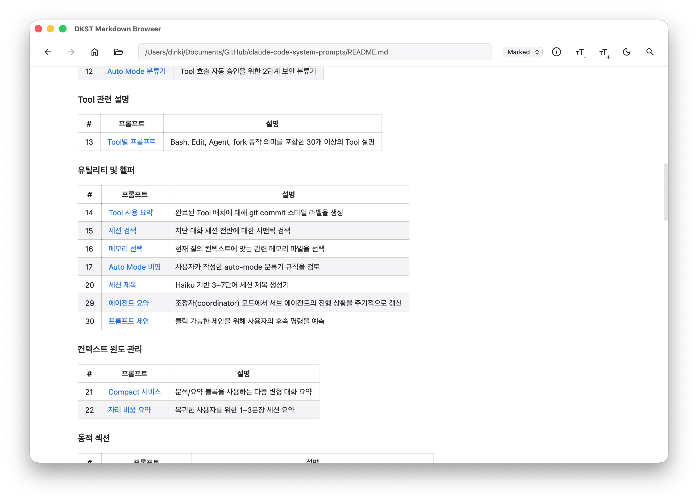

# DKST Markdown Browser

A lightweight, elegant cross-platform Markdown viewer built with [Wails](https://wails.io).



## Features

- **Dual Rendering Engines**: Choose between `Marked` and `Remark` for your preferred rendering style.
- **Search & Navigation**: Quickly search for keywords within the current folder and navigate through historical files.
- **Modern UI**: Sleek dark-mode interface with smooth transitions and Material Design icons.
- **Customizable**: Adjustable font sizes and live theme switching (Light/Dark).
- **Native Experience**: Native macOS menu bar, About dialog, and window controls.
- **File Management**: Recent files list and support for Drag & Drop to open files instantly.
- **Cross-Platform**: Optimized for macOS, Windows, and Linux.

## Prerequisites

- **Go**: Version 1.23 or higher
- **Wails**: Version v2.11.0 or higher
- **Node.js**: Version 18 or higher (with npm)
- **CGO Tools**: Required for native compilation (e.g., GCC or Clang)

## Building from Source

### macOS
The macOS build script generates a universal binary (if chosen) and handles the application bundle (`.app`).
```bash
chmod +x build_macos.sh
./build_macos.sh [arm64 | amd64 | universal]
```

### Windows
The Windows build script generates the executable (`.exe`) with embedded icons.
```cmd
build_windows.bat [amd64 | arm64 | 386]
```

### Linux
The Linux build script generates the binary for your specific architecture.
```bash
chmod +x build_linux.sh
./build_linux.sh [amd64 | arm64 | arm]
```

## Folder Structure

- `frontend/`: Svelte/React/Vue (standard JS/HTML/CSS) frontend assets.
- `build/`: Project icons, macOS `Info.plist`, and build-related assets.
- `dist/`: Final build output directory.
- `doc/`: Screenshots and documentation assets.

## License

Created by **DINKIssTyle**.
Copyright (c) 2026 DINKI'ssTyle. All rights reserved.
Refer to `THIRD-PARTY-NOTICES.md` for open-source library licenses.
