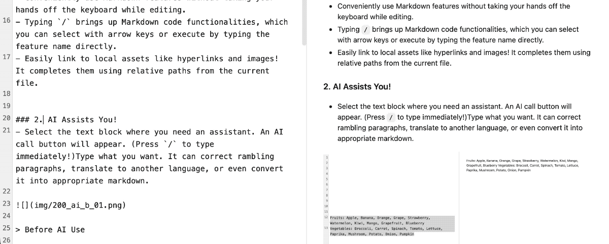
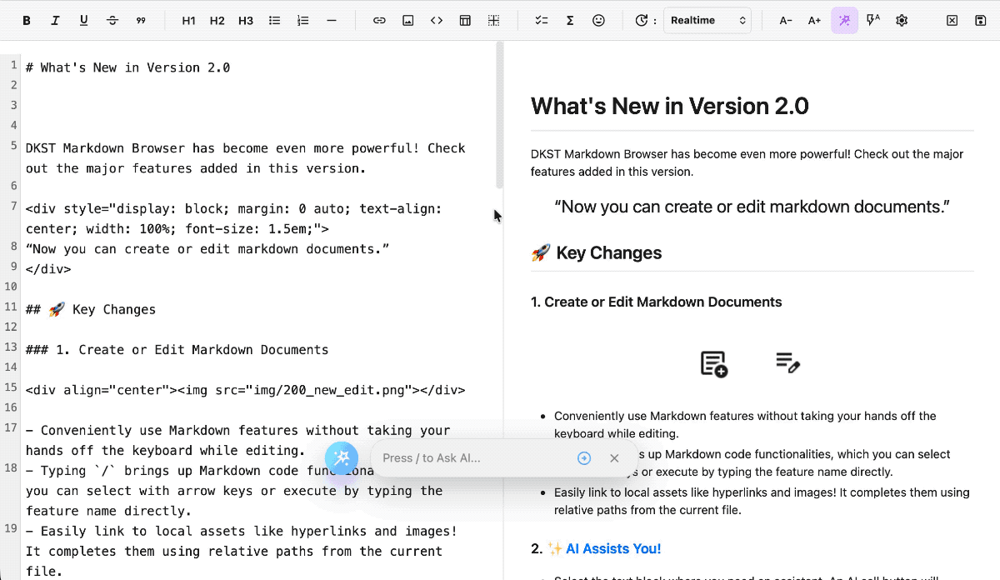
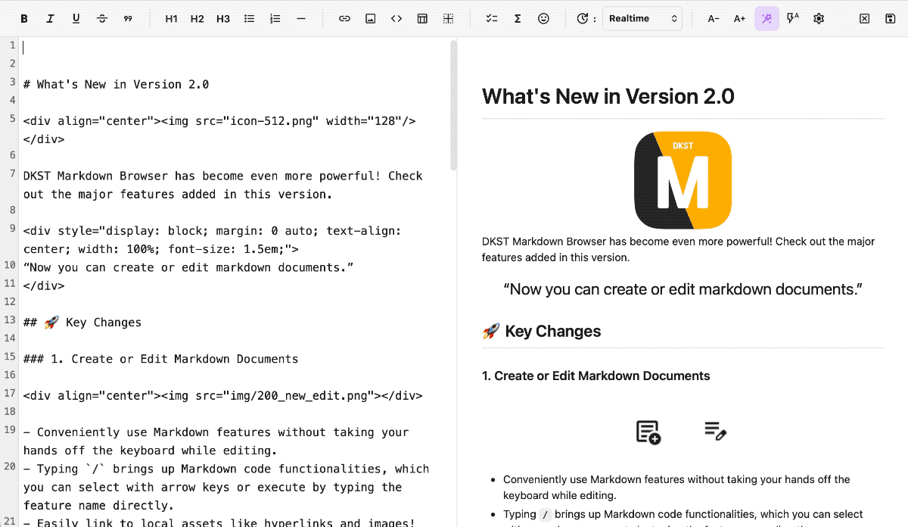

# DKST Markdown Browser Introduction

<p align="center">
  
</p>

<p align="center">
  <strong >Lightweight and Elegant Cross-Platform<br>Markdown Viewer & Editor!</strong>
</p>


<div align="center">
<a href="README-ko_KR.md">[한국어로 읽기]</a>
</div>


## NEWS

### ✨ New! Version 2.0!
- **AI Support**: AI assistant feature to write and edit Markdown documents.
- **Flow State**: A continuous writing Markdown editor that doesn't interrupt your workflow.
<p align="center">
  
</p>
<p align="center">
  
</p>
<p align="center">
  
</p>

---
# FEATURES

This document describes the features of DKST Markdown Browser.  
DKST Markdown Browser allows you to read, edit, or create new Markdown documents.

## Common

- **Open Markdown**: Open Markdown files.
- **Sidebar - File Tree**: Navigate the directory structure of opened documents.
- **Sidebar - Search**: Search keywords within opened documents and subfolders.
- **Image Viewer**: Provides basic functions like browsing and zooming in/out of opened images via the file tree.
- **Keyboard Accessibility**: Most functions are accessible or navigable using the keyboard.
- **Supported Extensions**: `.md`, `.markdown`


## Reader
#### DKST Markdown Browser excels at browsing hyperlinked Markdown documents and offers the following features:

- **Sidebar - Outline**: Visually displays the structure of a Markdown document, organizing it like a table of contents for quick navigation.
- **Hyperlink Navigation**: Browse hyperlinked Markdown documents like a web browser.
- **Home Function**: The first opened document serves as the home, allowing easy return to it even after navigating via hyperlinks.
- **Font Size Adjustment**: Easily adjust the document font size using buttons or keyboard shortcuts.
- **Light & Dark Themes**: Choose between light and dark themes to suit your preference.
- **Print Function**: Print the document.
- **Rendering Engines**: Select between `Marked` and `Remark`.
  - Rendered Items
    - **Formulas**: Renders LaTeX formulas to HTML using `katex*`.
    - **Diagrams**: Renders Mermaid code blocks to SVG using `Mermaid`.
    - **Syntax Highlight**: Renders code blocks using `highlight.js`.


 


## Editor

#### DKST Markdown Browser provides a modern Markdown document editing environment by embedding `CodeMirror`.

- **Syntax Highlight**: Supports Syntax Highlighting to improve editing readability; presets can be selected or custom color palettes configured in settings.
- **`/` Shortcut**: Pressing `/` while editing allows access to toolbar tools without mouse clicks.
- **Link Insertion**: Easily insert `URLs` or `local documents`. Inserting a `local document` uses relative paths, making document creation convenient.
- **Image Insertion**: Easily insert `URLs` or `local images`. Inserting a `local image` uses relative paths, making document creation convenient.
- **Insertion via Sidebar - File Tree**: Select a document, file, or image from the file tree and use the right-click menu to insert that item directly at the cursor position in the editor.
- **Intelligent Insertion Path Judgment**: When inserting documents or images, if paths contain spaces, they are enclosed in `<` and `>` for universality.
- **Documents Linked from Editor**: If you click a hyperlink in the document being edited, that document is displayed in the viewer. A floating button allows you to return to the editing document or open it in a new tab.
- **Sync Scrolling between Editor and Viewer**: Synchronizes the scroll position between the editing screen and the rendered viewer. This can be disabled in options.
- **Find and Replace**: Search or perform batch replacements within the document being edited.
- **CJK Compatibility Mode**: Provided for compatibility with `Marked Text` input methods used by Chinese, Japanese, and Korean input methods, preventing unnecessary blank lines.
- **Editor Font Size Adjustment**: Easily adjust the font size of the editor window using buttons or keyboard shortcuts.


>[!TIP] Learn about [Default Shortcuts](SHORTCUTS.md). Using shortcuts is very convenient.


## Editor with AI Assist
DKST Markdown Browser offers AI assist utilizing a Local LLM. Please check the AI section in the editor settings to configure and toggle this feature.

- **Generate Multilingual Document Translation**: By pressing the `Translate Document` button in the editor and selecting your desired language, you can generate a translation of the currently edited document all at once.

- **AI Feature Toolbar**: When activated, an `AI` floating button appears in the bottom left of the editor.
  - Click the AI button to temporarily pause features.
  - Click the expand button to show or hide the entire AI feature toolbar.
     - **Temperature**: Adjust temperature to control the creativity of the AI response. Higher temperatures result in more creative responses from the AI.
     - **Autocomplete**: Toggle Fill-in-the-Middle (FIM). Proper operation requires selecting an appropriate LLM model.
     - **Context+**: Uses parts of the text before and after the selected text as context to assist the user. This may require more context budget and processing time.
     - **Github Compatible**: If writing GitHub documents, the AI attempts assistance compliant with GitHub Flavored Markdown (GFM) specs.
     - **Talk to me**: The AI processes the user's response and reports back on the processing content in brief **every time**.


### Trying out AI Features

#### Getting AI Assist with Text Selection
1. Select the sentence you are editing. The AI prompt window appears upon selection.
1. Press `/` to directly input the prompt into the prompt window.
1. Try starting simply like this: `Improve sentence`, `Translate to English`
1. The selected sentence will be improved or translated.

Prompt Examples: "Organize into a table", "Wrap in div and center align with 128px width", "Change to lowercase", "Rewrite the sentence in simpler terms", "Spell check", "Draw as a diagram"

#### Getting AI Assist without Text Selection
1. Press `/` and select `Ask AI` (Enter key) to bring up the AI prompt window.
1. You can also call the AI prompt using a shortcut: `CTRL+/` or `⌘+/`
1. Try starting simply like this: `Enter a table of 10 fruits and vegetables`, `Write the benefits of apples briefly in Markdown format`
1. You will see a table of fruits and vegetables, or the benefits of apples in an LLM-like response.

Prompt Examples: "Draw a cat inside a code block", "Write a Python Hello World example"

>[!Note] The LLM operating in DKST Markdown Browser does not save the context of the conversation. This is to remain faithful to its role as a tool, and it does not remember previous conversations. Furthermore, it cannot refer to any external information such as the internet, current time, or location.

- **Recommended LLM Models**
   - Use an LLM model in the `3B~4B` scale that has little or no reasoning capability, or where reasoning can be turned off.
   - **AI Assist Quality** can vary greatly depending on the LLM model used.


## Download
Download the latest release executable [by clicking here](https://github.com/DINKIssTyle/DINKIssTyle-Markdown-Browser/releases).


## Installation

### Windows
Move the executable file to your desired location and use it.

### macOS
The standard method is to move the executable (app bundle) to the `Applications` folder or `~/Applications` directory.

**Since this app does not have a trusted developer signature, you must remove the 'Quarantine' attribute.** Removing the 'Quarantine' attribute directly makes the app a trusted file.
> The following command is for when the app is installed in the Applications folder.

```bash
xattr -cr "/Applications/DKST Markdown Browser.app"
```
Press `Enter` after entering the command to remove quarantine.

### Linux (Ubuntu, CentOS, etc.)
Run the executable and click the installation link at the bottom of the start page to complete the installation.


## Sponsorship
<div>
<a href="https://github.com/sponsors/DINKIssTyle">
    
  </a>
  <br> Sponsorship helps me continue improving this project. — And it gives you a perfectly valid excuse to work late at night without causing trouble at home.
</p><br></div>


## Advanced Users


### Prerequisites

- **Go**: Version 1.23 or higher
- **Wails**: Version v2.11.0 or higher
- **Node.js**: Version 18 or higher (including npm)
- **CGO Tools**: Required for native compilation (e.g., GCC or Clang)

### Building from Source

#### macOS
The macOS build script generates a universal binary (if selected) and handles the application bundle (`.app`).
```bash
chmod +x build-macOS.sh
./build-macOS.sh [arm64 | amd64 | universal]
```

#### Windows
The Windows build script generates an executable file (`.exe`) including icons.
```cmd
build-Windows.bat [amd64 | arm64 | 386]
```

#### Linux
The Linux build script generates a binary suited for specific architectures.
```bash
chmod +x build-Linux.sh
./build-Linux.sh [amd64 | arm64 | arm]
```

## License

**Made by DINKIssTyle.**
Copyright (c) 2026 DINKI'ssTyle. All rights reserved.
Refer to `THIRD-PARTY-NOTICES.md` for open-source library licenses.

