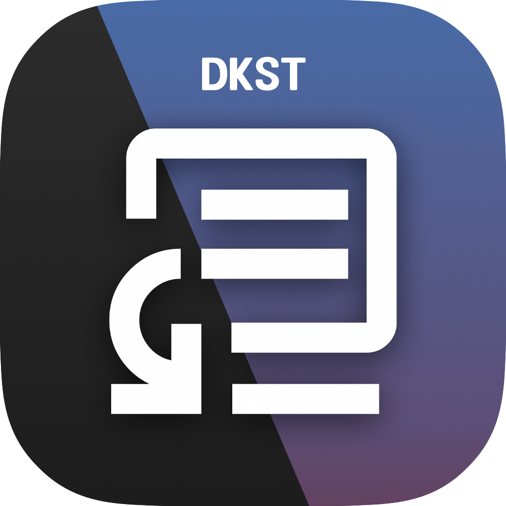

DKST Markdown Browserにご満足いただけたなら、次は**DKST Text Flow**を体験してみてください。スニペットショートカットが執筆作業をサポートします。AI支援はもちろん、OCRやフローティングスクリーンショットなど多様な機能で作業効率を高めます。[詳細はこちら](https://github.com/DINKIssTyle/DINKIssTyle-Text-Flow)

# バージョン 2.2の新機能

軽快でエレガントなクロスプラットフォーム Markdownビューア＆エディタ！

DKST Markdown Browserがさらに強力になりました！今回のバージョンで追加された主な機能をご確認ください。

# 変更点

## 2.2.3
#### 追加された機能 (New Features)
- **アップデート確認**: ウェブを介さずにアプリ内でアップデートを確認し、ダウンロードできます。
  - 設定 → アップデートタブから確認できます。
  - 制限事項: 現在は自動アップデートはなく、ダウンロードのみをサポートしています。

#### 改善点 (Improvements)
- **CJK互換性の向上**: リスト作成時のEnterキー入力による文字コミットやリスト解除の問題を解決しました。また、コマンド（/）使用時にEnterまたは矢印キー入力しても文字がコミットされず次の動作に進まなかった現象を修正しました。
- **履歴ナビゲーションのフィードバック改善**: トラックパッド操作時に表示されるアニメーションをよりスムーズにしました。

## 2.2.2

#### 新機能 (New Features)

- **フロントマターのサポート**: フロントマターを含むMarkdownドキュメントを開くと、アドレスバーに感嘆符ボタンが表示され、タブにはメタデータで定義されたタイトルが表示されます。
- **フロントマターの挿入**: エディットモードで感嘆符ボタンを押すと、タイトル、著者、日付、タグ、下書きなどの基本テンプレートが挿入されます。フロントマターを挿入すると、タイトルはMarkdownドキュメントの最初の行がデフォルトとなり、著者は設定 → エディタータブ → 著者名の値を使用し、日付は作成時点が入力されます。
- **メインツールバーボタンの表示カスタマイズ**: 設定 → 外観タブで、新規ドキュメント、エディットモード、翻訳、フォントサイズ、テーマボタンをメインツールバーに表示しないように設定できます。各機能には固有のショートカットキーがあります。
- **履歴ナビゲーションの改善**: macOSでトラックパッドやマウスを使用した場合に履歴の前後移動ができなかった問題を解決し、Windows、macOS、Linuxでトラックパッドジェスチャーを使用した場合に視覚的なフィードバックを追加しました。

#### 改善点 (Improvements)

- **エディターカーソル移動時のテキスト選択の問題を解決**: 最後の編集位置からタブ移動や設定ウィンドウを開いた後、その位置が見えない場所までスクロールした際に、最後の編集位置から新しい位置までテキストが選択されてしまう問題を解決しました。
- **低解像度サポートの向上**: 1280x720のような低い解像度のワークスペースでタイトルバーが表示されない問題を解決するため、デバイスの解像度が低い場合は自動的に最大化モードで実行されるようになりました。

## 2.2.1

#### 追加機能 (New Features)
- **編集モードでの縦/横切り替え**: 編集モードでプレビューと分割方向を設定できるようになりました。
- **編集モードでのエディタ/プレビューの位置調整**: 編集モードでエディタとプレビューの配置を変更できます。
- **編集モードでの分割比率調整**: 分割バーをドラッグすることで、エディタとプレビューの表示比率を調整できます。ヒント：分割バーをダブルクリックすると1:1でリセットされます。
- **編集モードでのプレビューの無効化**: エディタツールバーからプレビューを簡単にオン/オフできます。ヒント：ショートカット Ctrl+G / CMD+G

#### 改善点 (Improvements)
- **設定画面の全面刷新**: モダンで洗練されたデザインに生まれ変わりました。
- **最近使ったファイルのクリアボタン**: 固定ファイルを除き、リストを空にする動作に変更されました。

## 2.2.0
#### 改善点 (Improvements)
- **CJK IME Enter Fixによる改行の改善**: 設定 → Editor で `CJK IME Enter Fix` オプションが有効な場合、CJK文字入力中にエンターキー1回で改行が可能になりました。（影響を受けるプラットフォーム：macOS, Linux）

#### その他
- **ベータ表示の削除**: 十分に安定化したため、ベータ表示を削除しました。

## バージョン 2.1 期間中の変更点

### 主な変更点 (Highlights)
- **統合サイドバーの導入**: ファイルツリー、アウトライン(Outline)、検索機能が統合されたサイドバーを追加 (CTRL+ALT+S / macOS: CMD+OPT+S)
- **Markdown構文ハイライト(Syntax Highlight)**: Python、Bashなどのコードブロックレンダリング時に構文ハイライトを追加

#### 追加された機能 (New Features)
- **サイドバー専用ショートカット**: ファイルツリー(ALT+1)、アウトライン(ALT+2)、検索(ALT+3)ショートカットを追加
- **エディタ挿入機能の強化**: ファイルツリーからハイパーリンクおよび画像を編集中のドキュメントに直接挿入する機能を追加
- **表挿入の視覚化**: /table コマンド入力後、キーボードの矢印キーを使って直感的に表を挿入する機能を追加
- **高度な絵文字挿入**: キーボードナビゲーションが可能でカテゴリ別に分類された絵文字挿入モーダルウィンドウを追加
- **AI多言語翻訳およびスペルチェック**: 編集中のドキュメントを希望の言語に一括翻訳したり、スペルをチェック・校正する機能を追加
- **ビューア専用翻訳**: 編集せずに現在のドキュメントを一時的に翻訳して表示したり、翻訳版を保存できる機能を追加
- **リストおよび書式オプション**: 順序付きリスト(Ordered List)の番号増加方式(1. 1. 1. または 1. 2. 3.)選択機能およびカスタム蛍光ペンカラー選択機能を追加
- **レベル別ツールバーの提供**: ユーザーのMarkdown熟練度に応じて3種類のエディタツールバー(Beginner, Rookie, Pro)セット選択機能を追加
- **ビューア表示設定**: Markdownビューアのデフォルトフォント変更機能および余白3段階調整機能を追加
- **タブおよびファイル管理**: 閉じタブを再度開く(CTRL+SHIFT+T)、名前を付けて保存、最近開いたファイルリストのブックマーク(ピン留め)機能を追加

#### 改善事項 (Improvements)
- **ポップアップツールチップおよびUI改善**: ハイパーリンクホバー時に移動先アドレスを表示＆多言語対応、絵文字トースト通知をGoogle Material Symbolsに変更
- **サイドバーの操作性強化**: キーボードのTabおよび矢印キー移動に対応、アウトライン(Outline)書式を見出しサイズに応じて太字/サイズが区別されるよう改善
- **ファイルツリーの利便性向上**: フィルタークリック時に対応ファイルのみ表示、開いているファイルを削除した際に該当タブを自動終了、右クリックメニューに読み取りモード専用の「新しいタブで開く」を追加
- **編集およびタブ体験の改善**: 未保存状態を示す警告アイコンの表示、別のファイルを開く際に新しいタブで開く、タブを閉じるアニメーションの追加、編集タブ復帰時に以前のスクロール位置およびカーソル位置を記憶
- **AIおよびタスク処理の高度化**: 翻訳時に最後に選択した言語を記憶、OpenAIおよびLM StudioモードでLLMリアルタイムストリーミング(Delta)応答を表示
- **マルチタスクの安定性確保**: 複数タブ編集時にタブ間の作業履歴を完全分離、タブを切り替えても翻訳/スペルチェック作業が維持され汎用進捗バーで状態を継続表示
- **タスクスケジューリング**: LLMタスク進行中に新しいリクエストが入った場合、前のタスク完了後に順次処理されるよう改善
- **スタートページ設定**: 最近開いた項目を表示する数をユーザーが直接調整できるよう改善
- **機能統合および視覚的安定化**: 類似機能のグループ化と統合、読み取り/編集モード切り替え時に発生する画面のチラつき問題を解消
- **デザインの一貫性**: DKSTシリーズドキュメントとの一貫性を維持するため、ドキュメントアイコンのデザインを細部調整

#### バグ修正 (Bug Fixes)
- **パフォーマンス最適化**: 多くのフォントがインストールされている環境でアプリ起動ごとにフォントを再読み込みし準備時間が長くなっていた起動速度低下問題を修正
- **AIプロンプトのエラー**: エディタでAIプロンプトウィンドウを閉じても画面に残り続けていた表示問題を修正
- **AIスペルチェックのエラー**: LLM応答解析ロジックを改善し、スペルチェック(SpellCheck)が断続的に失敗していた問題を修正
- **レンダリングエラー**: TASKフォーマットレンダリング時に不要な「•」記号が一緒に出力されていた問題を修正
- **ダイアグラムの視認性**: クラスダイアグラムレンダリング時に背景とテキスト色のコントラストが不足し文字が見えにくかった問題を修正
- **ショートカット衝突の解決**: 拡張された機能によって発生したショートカット衝突問題を解決し、関連ショートカットを一括調整 (スタートページ下部のドキュメントに反映)

---
© 2026 DINKI'ssTyle.
