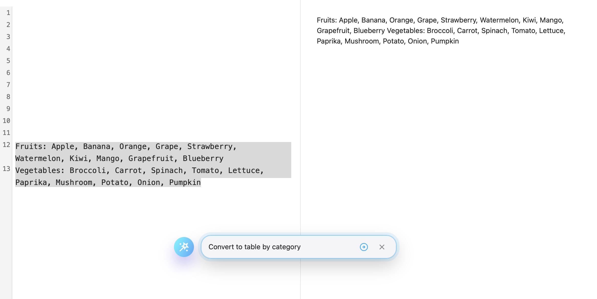
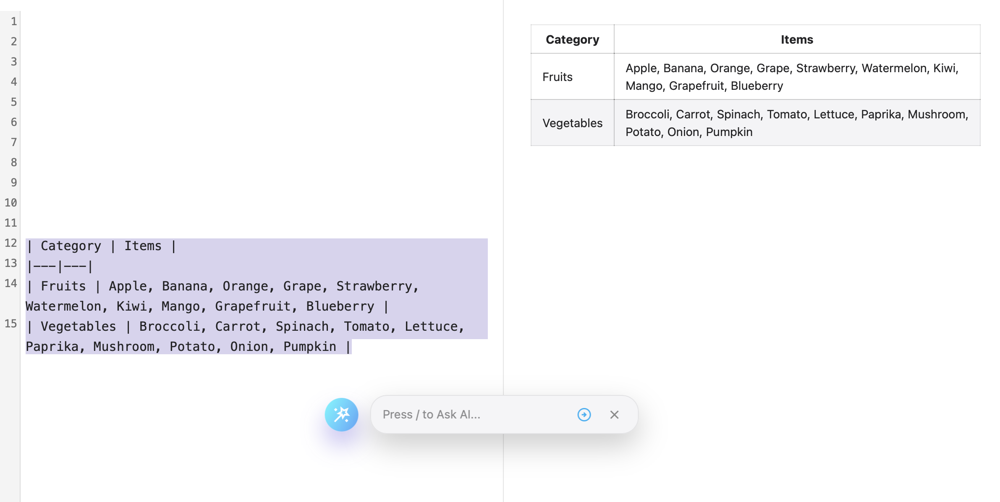
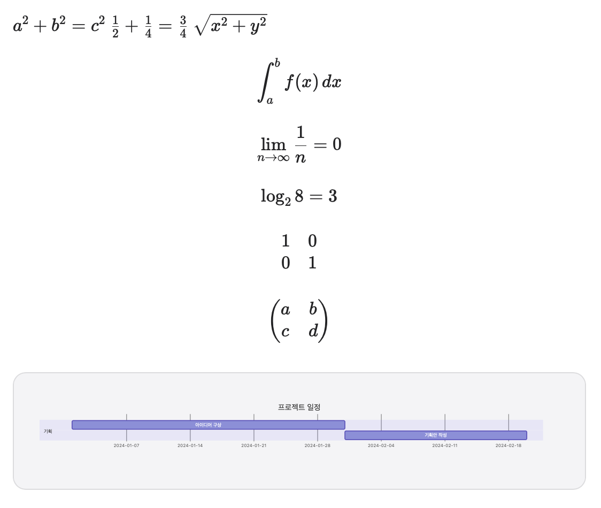

# What's New in Version 2.0

DKST Markdown Browser has become even more powerful! Check out the major features added in this version.

“Now you can create or edit markdown documents.”

## 🚀 Key Changes

### 1. Create or Edit Markdown Documents

- Conveniently use Markdown features without taking your hands off the keyboard while editing.
- Typing `/` brings up Markdown code functionalities, which you can select with arrow keys or execute by typing the feature name directly.
- Easily link to local assets like hyperlinks and images! It completes them using relative paths from the current file.

### 2. ✨AI Assists You!
- Select the text block where you need an assistant. An AI call button will appear. (Press `/` to type immediately!)Type what you want. It can correct rambling paragraphs, translate to another language, or even convert it into appropriate markdown.

> Before AI Use

> After AI Use

**💡 Note:** To use new AI features, you need an LM Studio (recommended) or OpenAI-compatible LLM API endpoint.

### 3. Mermaid Rendering Support
- Now supports rendering Mermaid diagrams.

---
# Recent Changes

## 2.0 Beta2

### Bug Fixes & Improvements
- Partially fixed the issue where the app frame was lost during drag and drop; investigating the cause of occasional occurrences.
- Merged the progress bar into the prompt window.
- The AI prompt window now opens from a fixed location. / Easily accessible with the / key.

### Feature Additions
- Added Cut to the right-click menu in the editor window.

## 2.0 Beta3

### UI/UX Improvements
* Redesign the tab interface for better compactness and modern aesthetics.
* Fixed an issue where clicking 'Close' on a deactivated tab would close it unexpectedly.
* Display the document name (title) in all save dialogs to indicate which document is being worked on.

### Bug Fixes & Polish
* Fixed an issue where the background color of dropdown menus was indistinguishable from the text, causing poor readability, specifically on Ubuntu in dark mode.
* Implement visual feedback using a border when the keyboard has focus in the AI prompt input field.

## 2.0 Beta4
### AI Feature Improvement
* Added option to send surrounding context
### Bug Fixes & Polish
* Fixed issue where formulas were not rendering
* Font size shortcut while editing in the editor should be reflected in the editor.
* Fixed issue where the editing screen did not change when switching tabs with multiple open tabs
---
(C) 2026 DINKI'ssTyle. All rights reserved.
