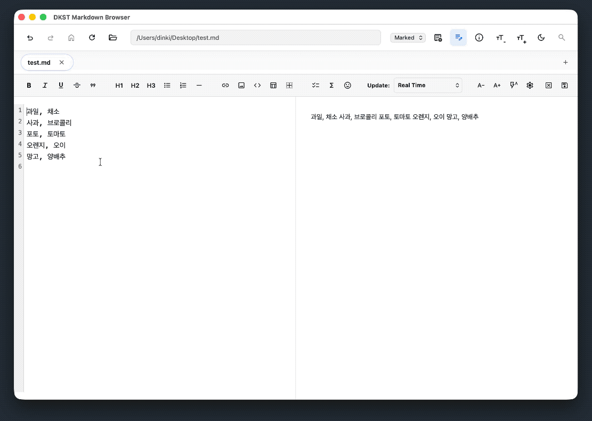
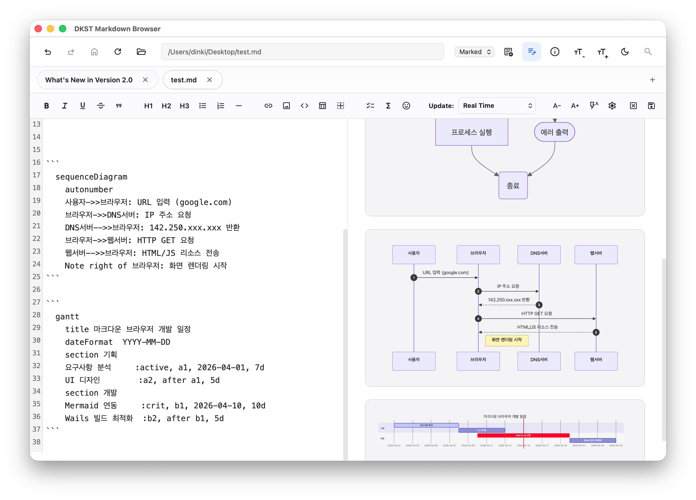

# What's New in Version 2.0

DKST Markdown Browser has become even more powerful! Check out the major features added in this version.

Now you can create or edit markdown documents.

## 🚀 Key Changes

### 1. Create or Edit Markdown Documents

- Conveniently use Markdown features without taking your hands off the keyboard while editing.
- Typing `/` brings up Markdown code functionalities, which you can select with arrow keys or execute by typing the feature name directly.
- Easily link to local assets like hyperlinks and images! It completes them using relative paths from the current file.

### 2. AI Assists You!
- Select the text block where you need an assistant. An AI call button will appear. (Press `/` to type immediately!)Type what you want. It can correct rambling paragraphs, translate to another language, or even convert it into appropriate markdown.

**💡 Note:** To use new AI features, you need an LM Studio (recommended) or OpenAI-compatible LLM API endpoint.

### 3. Mermaid Rendering Support
- Now supports rendering Mermaid diagrams.

---
(C) 2026 DINKI'ssTyle. All rights reserved.
