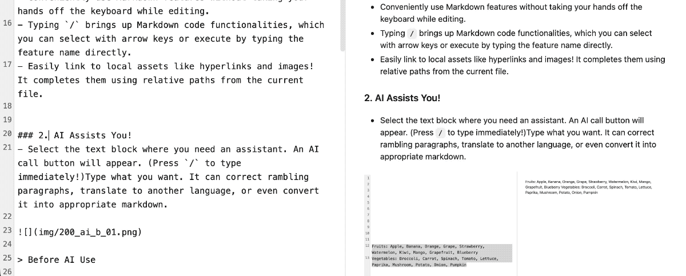
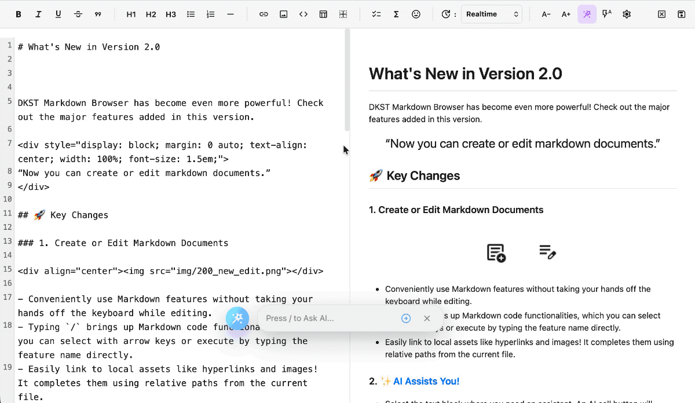
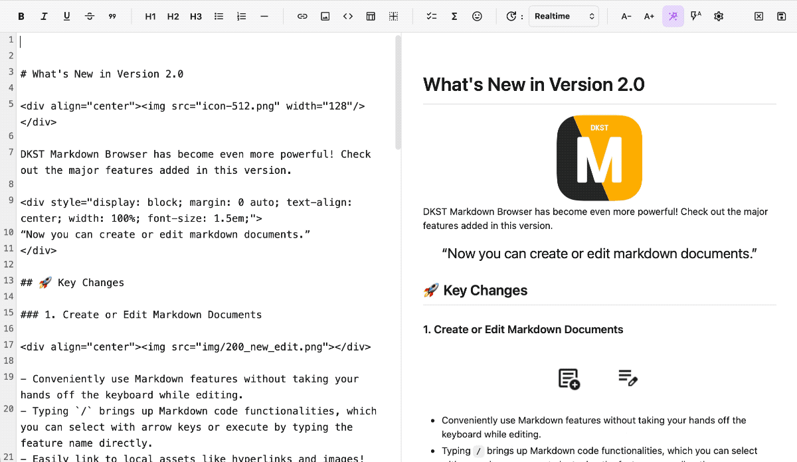

# What's New in Version 2.0

<div align="center"></div>

<div align="center" style="font-size: 1.2rem; font-weight: 700;"> Lightweight and elegant cross-platform<br>Markdown viewer and editor!</div>

<div align="center">DKST Markdown Browser has become even more powerful! Check out the major features added in this version.</div>

## 🚀 Key Changes

### 1. Create or Edit Markdown Documents
<div style="display: block; margin: 0 auto; text-align: center; width: 100%; font-size: 1.5em;">
“Now you can create or edit markdown documents.”
</div>

<div align="center"></div>

- Conveniently use Markdown features without taking your hands off the keyboard while editing.
- Typing `/` brings up Markdown code functionalities, which you can select with arrow keys or execute by typing the feature name directly.
- Easily link to local assets like hyperlinks and images! It completes them using relative paths from the current file.


### 2. <span style="color:#007bff;">✨AI Assists You!</span>
- Select the text block where you need an assistant. An AI call button will appear. (Press `/` to type immediately!)Type what you want. It can correct rambling paragraphs, translate to another language, or even convert it into appropriate markdown.

<div align="center"></div>
<div align="center"></div>
<div align="center"></div>


**💡 Note:** To use new AI features, you need an LM Studio (recommended) or OpenAI-compatible LLM API endpoint.

### 3. LaTeX, Mermaid Rendering Support

#### LaTeX Example
  
* $a^2 + b^2 = c^2$
* $\frac{1}{2} + \frac{1}{4} = \frac{3}{4}$
* $\sqrt{x^2 + y^2}$

$$\int_{a}^{b} f(x) \,dx$$
$$\lim_{n \to \infty} \frac{1}{n} = 0$$
$$\log_{2} 8 = 3$$
  
$$
\begin{matrix}
1 & 0 \\
0 & 1
\end{matrix}
$$
  
$$
\begin{pmatrix}
a & b \\
c & d
\end{pmatrix}
$$
  
$\alpha, \beta, \gamma, \delta, \pi, \sigma$
$\sum_{i=1}^{n} i$
$\prod_{i=1}^{n} a_i$
$x \neq y, x \leq y, x \geq y$
  
#### Mermaid Example

```
graph TD
A[Start] --> B{Decision}
B -- Yes --> C[Result 1]
B -- No --> D[Result 2]
```


```
sequenceDiagram
user->>server: Login request
server-->>database: Check user
database-->>server: Confirmation complete
server-->>user: Login successful
```


```
gantt
title Project Schedule
dateFormat YYYY-MM-DD
section Planning
Idea Conception     :a1, 2024-01-01, 30d
Proposal Writing    :after a1, 20d
```

---
# Recent Changes

## 2.0 Beta2

### Bug Fixes & Improvements
- Partially fixed the issue where the app frame was lost during drag and drop; investigating the cause of occasional occurrences.
- Merged the progress bar into the prompt window.
- The AI prompt window now opens from a fixed location. / Easily accessible with the / key.

### Feature Additions
- Added Cut to the right-click menu in the editor window.

## 2.0 Beta3

### UI/UX Improvements
* Redesign the tab interface for better compactness and modern aesthetics.
* Fixed an issue where clicking 'Close' on a deactivated tab would close it unexpectedly.
* Display the document name (title) in all save dialogs to indicate which document is being worked on.

### Bug Fixes & Polish
* Fixed an issue where the background color of dropdown menus was indistinguishable from the text, causing poor readability, specifically on Ubuntu in dark mode.
* Implement visual feedback using a border when the keyboard has focus in the AI prompt input field.


## 2.0 Beta4
### AI Feature Improvements
* Added option to send surrounding context
### Bug Fixes & Polish
* Fixed issue where formulas were not rendering correctly
* Font size shortcut used while editing should now be reflected in the editor.
* Resolved an issue where the editing screen failed to update when switching between tabs with multiple open tabs
* Enabled GitHub-compatible syntax in Remark mode.


## 2.0 Beta5
### AI Feature Improvements
* **Introduction of AI-specific toolbar:** With enhanced AI features, an AI-dedicated toolbar has been added at the bottom, making it easier to change Temperature and improving access to various AI functions.
* **Added GitHub compatibility mode**: When enabled, it prompts the LLM to respond only with GitHub-compatible code.
* **Talk to Me**: When this feature is enabled, AI leaves brief comments after the task.

### Bug Fixes & Polish
* **Stability Enhancement**: Fixed an issue where the preview scroll position was not being safely maintained during re-rendering in realtime rendering states.


## 2.0 Beta6
### AI Feature Improvements
* **Intelligent Support Agent:** Ask the AI agent simple questions through the `/ menu` without selecting text, or ask about selected text. You can also receive answers without editing.

### Bug Fixes & Polish
* **Stability Enhancement**: Polished it again. Fixed an issue where the preview scroll position was not safely maintained while re-rendering in real-time rendering state.
* **File Opening While Editing Issue**: Resolved an issue where opening certain files while editing caused them to open in the Markdown rendering viewer of the document being edited.

---
(C) 2026 DINKI'ssTyle. All rights reserved.
