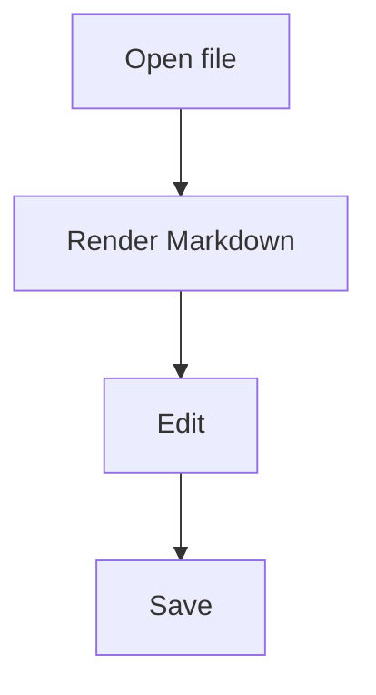

# GitHub Flavored Markdown Examples

Use these examples when GitHub-compatible mode is enabled.

Prefer Markdown first. Use simple GitHub-safe HTML only when Markdown cannot express the layout clearly, such as image sizing or centered README headers.

Do not wrap the whole response in a Markdown code fence unless the user explicitly asks for raw Markdown.

## Headings

Good:

# Project Name

## Features

### Details

Avoid:

<h1 style="font-size: 32px">Project Name</h1>

## Paragraphs And Line Breaks

Good:

This is the first paragraph.

This is the second paragraph.

Good, with an explicit break:

First line<br>
Second line

Avoid:

<p style="font-family: serif">Styled paragraph</p>

## Lists

Good:

- Fast preview
- Local file navigation
- AI-assisted editing

Good:

1. Open a Markdown file.
2. Edit the content.
3. Save the document.

Avoid:

<ul style="padding-left: 32px">
  <li>Fast preview</li>
</ul>

## Task Lists

Good:

- [ ] Draft outline
- [x] Review links
- [ ] Publish release notes

Avoid:

☐ Draft outline
✅ Review links

## Tables

Good:

| Feature | Status | Note |
| --- | --- | --- |
| Preview | Done | Stable |
| Editor | In progress | Needs review |
| Export | Planned | After beta |

Good, with alignment:

| Name | Count | Status |
| :--- | ---: | :---: |
| Tabs | 8 | OK |
| Files | 128 | OK |

Avoid:

<table style="width: 100%">
  <tr><td>Feature</td><td>Status</td></tr>
</table>

## Code Blocks

Good:

```js
console.log("hello");
```

Good:

```bash
npm run build
```

Avoid:

<pre><code>console.log("hello");</code></pre>

## Links

Good:

[GitHub Flavored Markdown](https://github.github.com/gfm/)

Good:

See [the setup guide](./docs/setup.md).

Avoid:

<a href="https://example.com" style="color: red">Example</a>

## Images

Good:


Good, with size:


Good, centered with a div:

<div align="center">
  
</div>

Good, with caption:

<div align="center">
  
  <br>
  <sub>Application screenshot</sub>
</div>

Avoid:


## Centered README Header

Good:

<div align="center">

# DKST Markdown Browser

Fast local Markdown browsing and editing.


</div>

Avoid:

<div style="display: flex; flex-direction: column; align-items: center;">
  <h1>DKST Markdown Browser</h1>
</div>

## Blockquotes

Good:

> Markdown is easiest to review when the structure stays simple.

Good, GitHub alert note:

> [!NOTE]
> GitHub supports alert-style blockquotes in many Markdown surfaces.

Good, GitHub alert tip:

> [!TIP]
> Use this when suggesting an optional improvement.

Good, GitHub alert important:

> [!IMPORTANT]
> Use this when the reader must not miss the information.

Good, GitHub alert warning:

> [!WARNING]
> Use this when a risky action needs attention.

Good, GitHub alert caution:

> [!CAUTION]
> Use this when an action can cause data loss or break behavior.

## Strikethrough

Good:

~~Old wording~~ New wording

Avoid:

<s style="color: gray">Old wording</s>

## Mermaid

Good:



Avoid:

Use custom SVG or HTML diagrams unless the user explicitly asks for them.

## Raw HTML

Good:

<kbd>Cmd</kbd> + <kbd>S</kbd>

Good:

<details>
<summary>Advanced options</summary>

- Enable AI features
- Choose a model
- Save settings

</details>

Avoid:

<font color="red">Important</font>

Avoid:

<span style="font-size: 18px; color: purple">Important</span>
